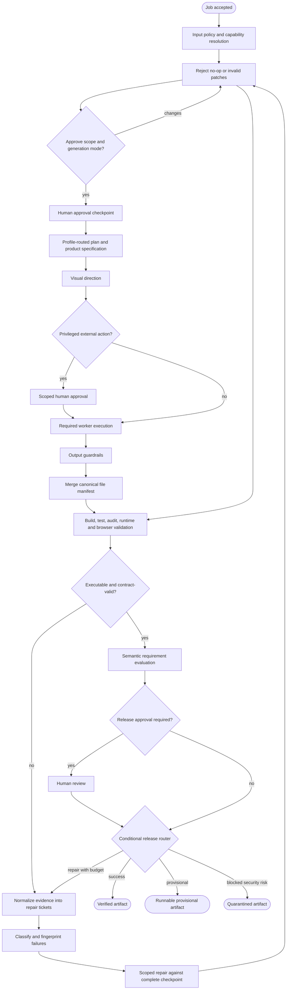

# Agentic Forge

Agentic Forge is a guarded, budget-aware multi-agent software development studio. It turns a
natural-language product request into a planned, generated, validated, repairable, previewable,
and downloadable software project while preserving human control over sensitive actions.

> **Project status:** local-first production-oriented MVP. Generated applications run in an
> isolated preview sandbox; public hosting and production deployment remain explicit provider
> actions rather than automatic side effects.

## Technology Stack

| Layer | Technology |
| --- | --- |
| Studio | Next.js 16, React 19, TypeScript, Tailwind CSS 4, shadcn/ui, AI Elements |
| Control plane | FastAPI, Pydantic, background job execution |
| Python packaging | uv with committed lockfiles and exact environment sync |
| Orchestration | LangGraph parent workflow and repair subgraph |
| Models | Configurable OpenAI role routing with per-run cost controls |
| Persistence | Supabase/PostgreSQL with LangGraph checkpoints and Store |
| Queue | In-memory queue or optional Redis |
| Tooling | MCP boundary, Serper search, safe image/video acquisition, Playwright automation |
| Validation | Deterministic capability adapters, tests, builds, audits, browser checks |
| Preview | Docker-isolated generated applications behind hardened proxies |
| Observability | Structured logs, metrics, cost ledger, optional LangSmith tracing |

## What It Does

- Accepts typed or editable voice-transcribed prompts plus user-supplied images and videos from the React studio UI.
- Offers Auto, Standard, and Advanced generation profiles while keeping monetary ceilings developer-controlled and automatically selected from request complexity.
- Runs input guardrails, capability resolution, planner, database/backend/frontend workers, adapter validation, the Universal Repair Kernel, evaluator, release routing, and loop protection.
- Uses budget-aware role routing: Luna for routing, database, evaluation, and artifact tasks; Terra for planning, frontend/backend generation, and ordinary repairs; Sol only for design and the final evidence-backed repair.
- Routes development tools through a secure MCP client/server boundary with allowlisted tool access, output redaction, and audit records.
- Supports Serper web and media search, bounded image/video download or verified embedding,
  Playwright browser tooling, LangGraph checkpoints and long-term memory, Supabase/Postgres
  persistence, Redis queueing, and LangSmith tracing behind feature flags.
- Pauses at capped human-in-the-loop checkpoints with database schema, backend architecture, and frontend screen visuals for approval or targeted revision.
- Derives explicit requested/excluded capabilities before planning, enforces worker path ownership, and rejects conflicting manifests.
- Preserves every latest project folder and ZIP under `generated-projects/` and `artifacts/`, with verified, provisional, or quarantined release status.
- Resolves every request into a versioned `ProjectSpec` and a certified capability pack instead of forcing every project through React/FastAPI.
- Starts verified and provisional applications in the configured sandbox; quarantined applications may run once only in an isolated Docker network and remain downloadable.
- Provides optimistic browser editing, revision history, WebSocket presence, visual CSS-token controls, and automatic ZIP refresh.
- Offers credential-gated GitHub branch/commit/PR sync and explicit-confirmation Supabase project provisioning.
- Keeps generated applications inside the local or Docker preview sandbox; public preview URLs and deployment are intentionally deferred until Agentic Forge has its own domain infrastructure.

## Current Release Highlights

### Automatic Generation Profiles

The Studio presents three understandable build modes without exposing a raw maximum-spend field:

| Mode | Intended workload | Budget behavior |
| --- | --- | --- |
| Auto | Recommended default | Deterministically selects Standard or Advanced from requested capabilities, domain adapters, and uploaded media |
| Standard | Focused sites, APIs, utilities, and smaller applications | Uses the normal model route and a developer-enforced hard ceiling of `$1.00` |
| Advanced | Full-stack, authentication, payments, databases, real-time systems, and media-heavy products | Uses expanded research and repair capacity with a `$1.50` default and `$5.00` developer ceiling |

The backend records the selected profile, estimated range, complexity signals, and authorized ceiling
before the first paid planning call. Studio users approve the product contract and generation mode;
they do not manually configure internal model-spend controls.

### Multimodal Project Intake

- Type a request or record a voice prompt, then review and edit its transcription before submission.
- Attach validated images and videos directly to the generation request.
- Let workers combine user uploads with permitted Serper-discovered downloads, remote media, or verified embeds when the product requires them.
- Keep user media references across human approvals and repair checkpoints without repeatedly uploading files.
- Copy only selected assets into the generated project and remove temporary upload/download caches when the workflow reaches a terminal state or replans.

### Conversational Project Explainer

Every verified build can open a separate Project Guide after generation. This is intentionally outside
the software-generation LangGraph and uses one lightweight `gpt-6-luna` model with no tools, shell,
filesystem writes, or artifact mutation capability.

- Answers architecture, stack, behavior, validation, and file-location questions from redacted project evidence.
- Allows at most ten user questions per generated project.
- Enforces a separate `$0.01` project budget and `$0.001` per-question authorization.
- Returns cached answers for repeated normalized questions without another model call.
- Rejects source-code reproduction, patches, fixes, rewrites, and modification requests with a deterministic zero-model-cost refusal.
- Keeps explainer messages and cost accounting separate from the generation ledger, so explainer failure cannot change build or release status.

### End-to-End User Journey

1. Name the project, describe it by text or voice, and optionally attach media.
2. Choose Auto, Standard, or Advanced generation mode and optionally select a certified stack.
3. Approve the product contract and any genuinely privileged provider action.
4. Watch planning, generation, validation, targeted repair, evaluation, and release routing in the Studio.
5. Approve the release, run the isolated preview, inspect validation evidence, and download the complete project ZIP.
6. Open Project Guide to ask read-only questions about the verified software.

## Architecture

### System Architecture

```mermaid
flowchart LR
    User["User"] --> Studio["Next.js Studio"]
    Studio --> Uploads["Validated User Media"]
    Studio --> Speech["Voice Transcription"]
    Studio --> API["FastAPI Control Plane"]

    API --> InputGuard["Input Guardrails"]
    InputGuard --> Graph["LangGraph Parent Workflow"]

    Graph --> Preflight["Deterministic Scope + Cost Preflight"]
    Preflight --> HITL["Upfront Scope + Mode Approval"]
    HITL --> Planner["Profile-Routed Planner"]
    Graph --> Design["Design Director"]

    Planner --> Workers
    Design --> Workers

    subgraph Workers["Specialized Workers"]
        Database["Database"]
        Backend["Backend"]
        Frontend["Frontend"]
    end

    Workers --> MCP["Secure MCP Tool Boundary"]
    MCP --> Search["Serper Search"]
    MCP --> Browser["Playwright Browser"]
    MCP --> Providers["GitHub / Supabase Providers"]
    Uploads --> Workers

    Workers --> Checkpoints["LangGraph Checkpoints + Project Memory"]
    Checkpoints <--> Postgres["Supabase / PostgreSQL"]

    Workers --> Assembly["Canonical Manifest + Artifact Assembly"]
    Assembly --> Validation["Capability Adapters + Executable Validation"]
    Validation --> Evaluator["Semantic Evaluator"]
    Evaluator --> Router{"Release Router"}

    Router -->|"verified"| Preview["Docker Preview + ZIP"]
    Preview --> Explainer["Read-only Project Explainer outside LangGraph"]
    Explainer --> Guide["Conversational Evidence-grounded Guide"]
    Router -->|"repairable"| Repair["Universal Repair Kernel"]
    Repair --> Workers
    Router -->|"security risk"| Quarantine["Quarantined Preview + Download"]

    Ledger["Global Cost Ledger"] -.-> Graph
    OutputGuard["DLP + Secret + Vulnerability Guardrails"] -.-> Assembly
```



### LangGraph Workflow



Human-review exits persist the graph state and do not consume worker-attempt or execution-loop
budgets. Repair nodes always receive the complete canonical project checkpoint, structured failure
evidence, and an explicit file scope. User uploads survive approval and repair checkpoints, are copied
only when selected by the generated application, and are removed from temporary storage at termination.

## Repository Layout

```text
.
├── backend/                  FastAPI API, agents, LangGraph orchestration and tests
│   └── uv.lock               Reproducible Python dependency graph
├── frontend/                 React/TypeScript studio and workflow interface
├── docs/                     Architecture and operational documentation
├── scripts/                  Local backend/frontend launch scripts
├── benchmark-results/        Local regression evidence and reusable campaign definition
├── generated-projects/       Local generated projects (ignored except .gitkeep)
├── artifacts/                Local ZIP outputs (ignored except .gitkeep)
├── .github/workflows/        Continuous-integration workflow
├── .env.example              Safe configuration template
└── docker-compose.yml        Local supporting infrastructure
```

## Certified Initial Stacks

| Capability ID | Output |
| --- | --- |
| `nextjs-fullstack` | Next.js App Router, TypeScript, route handlers |
| `react-fastapi` | React/Vite TypeScript frontend + FastAPI backend |
| `react-node` | React/Vite TypeScript frontend + Express TypeScript backend |
| `fastapi-api` | FastAPI service |
| `node-api` | Express TypeScript service |
| `react-vite` | Standalone React/Vite TypeScript frontend |
| `python-cli` | Installable Python command-line application |

Select a pack in the studio or send `metadata.capability_id` with `POST /api/jobs`. Auto-detection
remains available when the user does not select a stack. Databases are never added by default;
positive database requests generate PostgreSQL/Supabase migrations and configuration examples.

Stack packs are composed with deterministic domain adapters rather than extra always-running agents.
Adapters cover browser games, video/streaming, real-time behavior, commerce, analytics, auth/RBAC,
persistence, multi-tenancy, file uploads, AI integrations, content platforms, scheduling, and
geospatial products. Each adapter contributes focused acceptance criteria, worker guidance, and
preflight checks while the shared repair kernel remains domain-independent.

## Repair Workflow

The complete runtime is a persisted LangGraph parent graph: input guardrails, planning, design,
product approval, optional privileged approval, worker execution, output guardrails, artifact
assembly and adapter validation, evaluation, conditional routing, release approval, and terminal
success/failure handling are explicit nodes. Human-approval exits preserve graph state without
spending worker or execution-loop budget, and the same job resumes under its durable workflow
thread after feedback.

Executable failures enter the Universal Repair Kernel's nested failure-only subgraph:

1. Normalize command, file, line, expected/actual, and runtime evidence into a repair ticket.
2. Classify dependency, build, test-contract, runtime, integration, database, or requirement failure.
3. Fingerprint the normalized error so the same unresolved defect cannot silently advance.
4. Supply the repair worker with the complete canonical project, exact ticket, and allowed scope.
5. Reject no-op patches and patches that still fail deterministic semantic preflight.
6. Validate the repaired component first, then complete the remaining full-project checks.
7. Escalate a repeated fingerprint to the stronger repair model.
8. Reserve the final supported attempt for a stronger-model patch against the complete checkpoint;
   certified templates may supply trusted runtime contracts but never replace product code.

The four worker attempts are complete generation, targeted repair, escalated verified repair, and a
final evidence-backed patch. Malformed JSON, incomplete initial runtime contracts, empty manifests,
response-format recovery, and rejected no-op repair candidates do not consume those attempts.
`MAX_MANIFEST_RECOVERY_ATTEMPTS` bounds response-contract correction calls per worker invocation,
and `MAX_LLM_CALLS_PER_NODE` independently caps repeated provider calls. If initial model output
remains unusable, a certified runnable checkpoint is assembled, validated, preserved for download,
and sent through targeted repair rather than leaving the user with nothing. LangGraph checkpoints
preserve the complete manifest, and a rejected patch escalates strategy without spending an official
worker attempt.

React/Vite manifests receive a Docker-verified Node 20 runtime contract, automatic JSX configuration,
and compatible trusted testing-library versions before an official attempt is committed. Static
analysis that cannot resolve data-driven JSX becomes an advisory and is decided by executable tests.
If the four-attempt semantic budget is exhausted after a technically valid build, the latest runnable
artifact is retained as quarantined preview/download output and publication remains locked.

Adapter validation proves technical executability. The evaluator runs only after it passes and checks
semantic product correctness against explicit requirements. Evaluator concerns without an exact
requirement, contradictory evidence, location, and reproducible verification become nonblocking
warnings rather than repair attempts.

## Configure

Keep real secrets only in `.env`; this file is ignored by git.

```bash
cp .env.example .env
```

Fill the required values:

- `OPENAI_API_KEY`
- `SERPER_API_KEY` if `ENABLE_WEB_SEARCH=true`
- `LANGSMITH_API_KEY` if `LANGSMITH_TRACING=true`
- `DATABASE_URL`, `SUPABASE_URL`, `SUPABASE_ANON_KEY`, `SUPABASE_SERVICE_ROLE_KEY` if `ENABLE_PERSISTENCE=true`

Useful feature flags:

- `ENABLE_MCP_TOOLS=true` keeps tool calls behind the MCP boundary.
- `ENABLE_HUMAN_CHECKPOINTS=true` pauses for visual review checkpoints.
- `ENABLE_LANGGRAPH_CHECKPOINTING=true` preserves canonical generated-file state across retries and process restarts.
- `OPENAI_REPAIR_MODEL=gpt-5.6-sol` reserves the strongest configured model for repeated, evidence-backed failures.
- `MAX_MANIFEST_RECOVERY_ATTEMPTS=2` bounds non-budgeted manifest-format recovery calls.
- `MAX_LLM_CALLS_PER_NODE=6` caps repeated calls from any one model node in a job.
- `OPENAI_TRANSPORT_RETRIES=0` prevents hidden SDK retries from multiplying workflow latency and bypassing the visible recovery ledger.
- `ENABLE_GUARANTEED_ARTIFACT_FALLBACK=true` preserves a runnable certified checkpoint when initial model output is unusable and forces a targeted semantic repair before success.
- `MAX_HUMAN_CHECKPOINTS=4` caps approval prompts so workflows stay practical.
- `MAXIMUM_RUN_BUDGET_USD=1.00` caps Standard jobs; `MAXIMUM_ADVANCED_RUN_BUDGET_USD=5.00` caps the internal Advanced-mode authorization.
- Studio users never edit these monetary values. Auto mode derives the effective profile and budget from capability, adapter, complexity, and media signals; operators retain control through environment configuration.
- `OPENAI_TRANSCRIPTION_MODEL` controls editable voice-prompt transcription; recordings are not retained after transcription.
- `OPENAI_EXPLAINER_MODEL=gpt-6-luna` is the single model used by the read-only project explainer.
- `ENABLE_PROJECT_EXPLAINER=true` initializes a conversational explainer after verified release without adding a LangGraph node.
- `EXPLAINER_PROMPT_LIMIT=10` and `EXPLAINER_BUDGET_USD=0.01` enforce the per-build question and cost ceilings.
- The explainer cannot emit code, patches, commands, or project modifications; blocked requests use a deterministic refusal without an LLM call.
- `ENABLE_ARTIFACT_VALIDATION=true` installs generated dependencies, runs tests/builds, checks the shared API contract, audits dependencies, and labels failed output without discarding it.
- `ARTIFACT_VALIDATION_MEMORY_LIMIT_MB=2048` gives production compilers a separate sandbox budget from lightweight previews; resource kills are classified as infrastructure rather than worker defects.
- `ENABLE_LIVE_PREVIEW=true` enables preview lifecycle endpoints.
- `PREVIEW_SANDBOX_MODE=docker` enables isolated previews and is required for quarantined or production output.
- `ENABLE_BROWSER_EDITOR=true` and `ENABLE_COLLABORATION=true` enable revisions, file editing, visual tokens, and WebSocket presence.
- `ENABLE_PROVIDER_ACTIONS=false` prevents accidental repository or billable managed-service actions.

Optional provider credentials are `GITHUB_TOKEN` and `SUPABASE_MANAGEMENT_ACCESS_TOKEN`. Set
`ENABLE_PROVIDER_ACTIONS=true` only after configuring the
providers you intend to use. Supabase creation additionally requires `confirm_billing=true` on
each request; database passwords are forwarded once and are not persisted by Agentic Forge.

## Supabase Setup

1. Create a Supabase project.
2. Run `backend/migrations/001_initial_supabase.sql` in the Supabase SQL editor.
3. Put the pooled Postgres connection string in `DATABASE_URL`.
4. Set `ENABLE_PERSISTENCE=true` for durable job snapshots, LangGraph checkpoints, and project memory.
5. LangGraph creates its checkpoint and Store tables idempotently during backend startup.

## Run Locally

Install uv 0.12.x first; the backend currently requires at least 0.12.18. Node projects continue to
use npm because uv manages Python environments and packages, not JavaScript dependencies.

Backend:

```bash
cd backend
uv sync --locked --group dev --no-editable
cd ..
./scripts/run_backend.sh
```

Keep Docker Desktop or Colima running when artifact validation or preview sandbox mode is
`docker`. Install Playwright Chromium once with
`uv run --project backend --locked --no-sync playwright install chromium` to enable browser smoke
checks.

Frontend:

```bash
cd frontend
npm ci
npm run dev
```

Open `http://localhost:5173`. Requests to `/api/*` that no Next.js route handles fall back to
the Python API at `BACKEND_URL` (default `http://localhost:8000`).

> The studio is being rebuilt (see `docs/frontend/roadmap.md`). On the
> `feat/frontend-phase-1-design-system` branch the app serves the design-system reference at
> `/dev/states`; the working studio remains on `main` until Phase 3.

## Generated Output

After a workflow:

- Preview generated source files in the runtime console.
- Download the ZIP from the generated output panel.
- Find the local project folder in `generated-projects/`.
- Find the ZIP artifact in `artifacts/`.
- Inspect exact validation command results in job state and artifact metadata.
- Start or stop a live preview, inspect logs, and open each generated service URL.
- The studio preview permits same-origin module execution inside its isolated frame and falls back to the last Playwright screenshot if the live frame cannot load.
- Edit text files with SHA-256 conflict protection; every prior version is retained outside the exported project.
- Adjust existing CSS custom properties in the visual token editor without allowing arbitrary CSS injection.
- Sync only a verified snapshot to a GitHub branch and pull request when provider actions are enabled.
- Test the application only through the sandbox preview. Agentic Forge does not currently create public preview or production URLs.
- Open the read-only Project Guide after verified release for an evidence-grounded conversation about architecture, behavior, validation, and project files.
- External services such as GitHub, CI/CD, hosting, payments, or cloud databases are scaffolded only when positively requested and use `.env.example` placeholders instead of real credentials.

Every latest manifest is preserved as a project folder and ZIP. Passing output is `verified`.
Non-security validation failures are `provisional`. Confirmed blocking security findings are
`quarantined`: they remain downloadable and receive a one-time Docker-isolated preview, but GitHub
publication stays locked. The job records commands, exit codes, output excerpts, findings, and
targeted retry decisions in `artifacts/risk-report.json`.

Generated backends contain exactly one Python dependency strategy. Certified capability packs
override LLM-selected core framework versions, preserve audited optional dependencies, create
`uv.lock` with uv or `package-lock.json` with npm, and verify them with `uv sync --locked` or
`npm ci`. Production dependencies block at high severity; development dependencies block at
critical severity and retain high findings as visible advisories.

## Validation

```bash
cd backend && uv run --locked --no-sync pytest
cd frontend && npm run lint && npm run typecheck && npm test && npm run build
```

Run the repeatable twelve-case benchmark, including heritage, commerce/RBAC, browser-game,
video/upload, and real-time multi-tenant scheduling regressions, without network access:

```bash
uv run --project backend --locked --no-sync python \
  -m software_developer_agent.benchmarks.runner \
  --repeat 2 --output benchmark-results/latest.json
```

Add `--execute` to install every selected generated dependency and run each generated test/build,
and use repeated `--case CASE_ID` arguments to select cases. The
offline mode checks deterministic output, structural contracts, exact dependency declarations,
tests, documentation, traceability, and exclusion compliance. The execution mode additionally
runs stack-level dependency, test, build, and runtime quality gates while intentionally leaving
prompt-specific semantic enforcement to live mode. Production and live workflows always keep
`ENABLE_DOMAIN_ADAPTER_VALIDATION=true`.

Run selected prompts through the complete configured LLM workflow with `--live --case CASE_ID`.
Live mode records status, release state, attempts, fallback usage, artifact availability, and model cost.

Run the opt-in Docker and headless Chromium regression from the repository root:

```bash
RUN_DOCKER_REGRESSION=1 LANGSMITH_TRACING=false LANGCHAIN_TRACING_V2=false \
  uv run --project backend --locked --no-sync python -m pytest -q \
  backend/tests/integration/test_heritage_runtime.py \
  --basetemp=.agentic-forge/repair-regression-tests
```

This requires a running Docker daemon and installed Playwright Chromium. It reproduces missing
React runtime configuration, data-driven headings, JSX tests without React imports, and a local
image/interaction in the isolated preview. It checks a fixture, not live model quality, and stops
its preview containers afterward. Preview readiness waits for HTTP, not just an open proxy port.

The API accepts long-running generation jobs with HTTP `202` and executes them in the background.
The studio polls job state, preventing model calls and dependency installation from occupying one
long browser request.

Verified builds expose `GET /api/jobs/{job_id}/guide`, the idempotent
`POST /api/jobs/{job_id}/guide`, and `POST /api/jobs/{job_id}/guide/messages`. The single-model
explainer retrieves a redacted, size-bounded evidence bundle for each question and stores its
conversation separately from the generation cost ledger. It permits ten prompts, caches repeated
answers, enforces a one-cent hard budget, and has no artifact-write or execution capability. Its
failure never changes build or release status.

## Production Notes

- Use Supabase Postgres for persistence first; move to AWS RDS only if you need VPC-local networking or heavier operational control.
- Use Upstash/Redis-compatible infrastructure for queueing first; move to ElastiCache only if AWS-private networking is required.
- Store production secrets in the managed secret system selected for the future production environment, not in `.env`.
- Add identity and tenant authorization before exposing job, artifact, collaboration, preview, or provider endpoints publicly.
- Local preview mode is intentionally limited to trusted development. Production startup rejects
  local mode and requires the Docker sandbox, which applies a read-only root, dropped Linux
  capabilities, `no-new-privileges`, PID, memory, CPU, and temporary-filesystem limits.
- Quarantined applications run on an internal Docker network behind a hardened Nginx proxy, so the
  browser can reach the preview while the generated application has no direct external egress.
